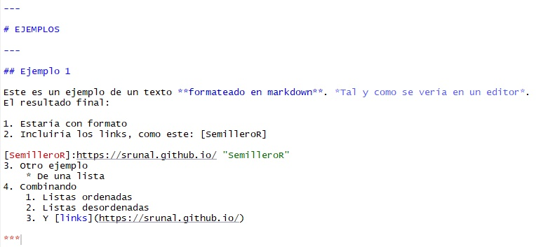
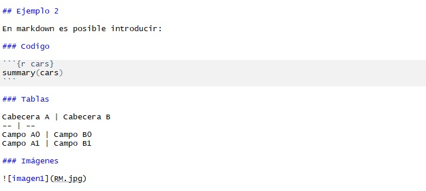

```{r setup, cars, include=FALSE}
knitr::opts_chunk$set(echo = TRUE)
```

# ¿Que es Markdown?

**Markdown** es un lenguaje de marcado que facilita la aplicación de ***formato*** a
un texto empleando una serie de *caracteres* de una forma especial.

# Ventajas de markdown

* Fácil de Aprender.
* Fácil de leer.
+ Veloz a la hora de ingresar información.
- El archivo puede ser exportado luego a HTML.

---

# EJEMPLOS

---



## Ejemplo 1

Este es un ejemplo de un texto **formateado en markdown**. *Tal y como se vería en un editor*.
El resultado final:

1. Estaría con formato
2. Incluiría los links, como este: [SemilleroR]

[SemilleroR]:https://srunal.github.io/ "SemilleroR"
3. Otro ejemplo
    * De una lista
4. Combinando 
    1. Listas ordenadas
    2. Listas desordenadas
    3. Y [links](https://srunal.github.io/)

***


## Ejemplo 2

En markdown es posible introducir:

### Codigo

```{r cars}
summary(cars)
```

### Tablas

Cabecera A | Cabecera B
-- | --
Campo A0 | Campo B0
Campo A1 | Campo B1

### Imágenes


# Cibergrafía

https://www.youtube.com/watch?v=TtSWo2nbzAk

http://joedicastro.com/pages/markdown.html#mark14

