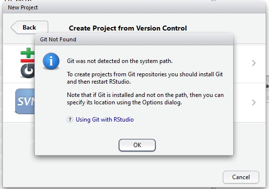
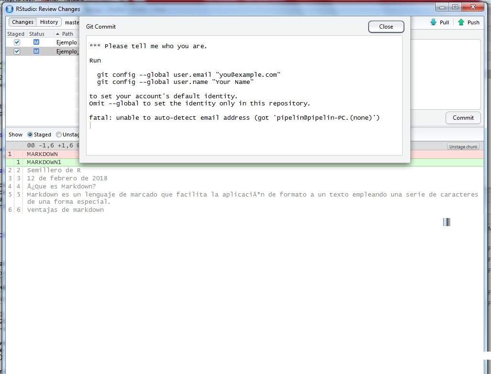

# Pasos

1. Instalar Git.

Se puede descargar gratuitamente en el siguiente link: <https://git-scm.com/>

2. Registrar correo y nombre de usuario en Git.

    a. Clonar un repositorio de github
    
    

    b. Crear un Nuevo Proyecto de RStudio
    
    c. Seleccionar versión de control
    
    

    d. Seleccionar git
    
    

    e. En la ventana siguiente con el commando ***Ctrl+v*** pegar el directorio clonado de github y dar click en el botón señalado.
    
    

    f. A continuación en la ventana de RStudio dar click en la parte señalada en la siguiente imagen.
    
    
  
    g. En el botón señalado escoger la opción ***Shell***
    
    
    
    h. En la ventana resultante se copian las tres líneas de código siguientes:
    
        - `git init`
        - `git config user.name "NombreUsuario"`
        - `git config user.email "email@algo.com"`
    
    
    
3. Al hacer push por primera vez se debe registrar el usuario y la contraseña de la cuenta de github.

    a. Ingresar nombre de usuario
    
    
    
    b. Ingresar contraseña
    
    
    
# Errores frecuentes
    
- Cuando Git no está instalado

En este caso es necesario seguir ***todos los pasos*** de esta guia.

- Cuando se va a hacer comit sin registrarse en Git

En este caso es necesario seguir los pasos ***desde el 2.f hasta finalizar la gia***    

    
    