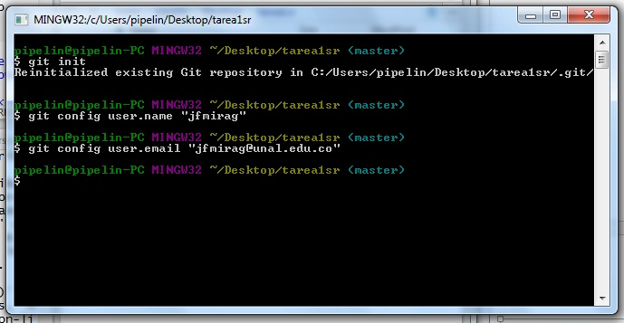

# Pasos para trabajar con Rmarkdown y GitHub

1. Instalar Git.

Se puede descargar gratuitamente en el siguiente link: <https://git-scm.com/>

2. Registrar correo y nombre de usuario en Git.

    a. Clonar un repositorio de github
    
    

    b. Crear un Nuevo Proyecto de RStudio
    
    

    c. Seleccionar vercion de control
    
    

    d. Seleccionar git
    
    

    e. En la ventana siguiente con el commando Ctrl+v pegar el directorio clonado de github y dar click en el boton señalado.
    
    

    f. A continuacion en la ventana de RStudio darclick en la parte señalada en la siguiente imagen.
    
    
  
    g. En el boton señalado es coger la opcion **Shell**
    
    
    
    h. a continuacion se copian las tras lineas de codigo siguientes:
    
        - git init
        - git config user.name "NombreUsuario"
        - git config user.email "email@algo.com"
    
    
    
3. Al hacer push por primera vez se debe registar el usuario y la contraseña de la cuenta de github.

    a. Ingresar nombre de usuario
    
    
    
    b. Ingresar contraseña
    
    